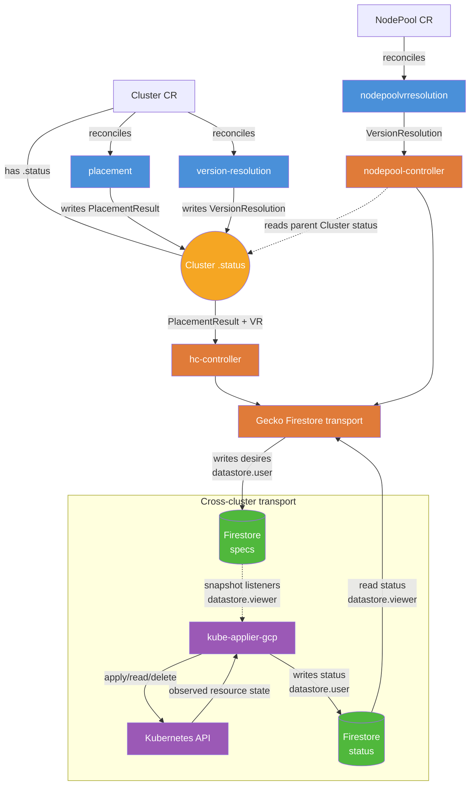
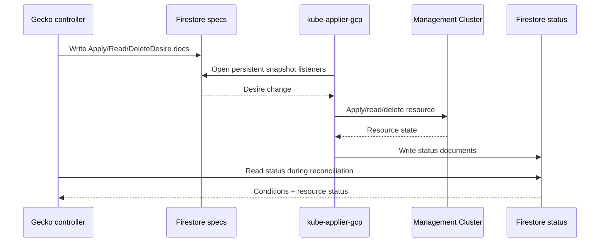

# Gecko Controllers

The controllers module contains the Kubernetes-style reconciliation controllers that drive the Gecko lifecycle. Each controller is independently deployable as a subcommand of the `gecko-controllers` binary.

## Reconciliation Model

Gecko controllers follow the same reconciliation loop pattern used by Kubernetes itself, built on top of [controller-runtime](https://pkg.go.dev/sigs.k8s.io/controller-runtime):

1. **Watch** a resource type (e.g., `Cluster`, `NodePool`) for changes
2. **Enqueue** a `reconcile.Request` when a create, update, or delete event occurs
3. **Reconcile** — compare desired state (`.spec`) against current state (`.status`), take action to converge, and update status
4. **Requeue** to retry later if the desired state isn't yet reached

This approach is:
- **Declarative** — controllers react to desired state, not imperative commands
- **Level-triggered** — reconciliation is idempotent; it doesn't matter *what* changed, the controller always computes the full diff from current state
- **Eventually consistent** — if a reconcile fails, it requeues and retries until convergence

Gecko controllers use controller-runtime's `Manager`, `Reconciler` interface, and caching client to watch resources from the platform API, applying the same operator pattern used across the Kubernetes ecosystem.

## Architecture Overview



## Controllers

### placement

Reconciles `Cluster` resources. Selects an eligible management cluster and DNS base domain for newly created clusters.

- Discovers management clusters dynamically from GCP Secret Manager (secrets labeled `mc-registration=true`)
- Filters by `mode=active`, caches results for 30s
- Round-robins across eligible MCs and configured DNS domains
- Writes `Status.PlacementResult` (ManagementClusterName, BaseDomain)

### version-resolution

Reconciles `Cluster` resources. Resolves the OCP release image for the requested version via the Cincinnati API.

- Queries the Cincinnati update graph for the matching release payload
- Writes `Status.VersionResolution` (ReleaseVersion, ReleaseImage, CincinnatiChannel)

### nodepool-vr (NodePool Version Resolution)

Reconciles `NodePool` resources. Same concept as version-resolution but for individual node pools.

### hc-controller (HostedCluster Controller)

Reconciles `Cluster` resources. Builds and applies HostedCluster manifests to the assigned management cluster.

**Readiness gates (must pass before applying):**
1. Placement ready (`Status.PlacementResult.ManagementClusterName` set)
2. Version resolution ready (`Status.VersionResolution` set)
3. Version match (resolved version matches `Spec.Release.Version`)

Builds HyperShift HostedCluster manifests from the cluster spec (GCP platform fields, workload identity, service accounts, networking) and applies them via the transport layer. Tracks `ResourcesApplied`, `HostedClusterAvailable`, and `ApiCertificateReady` conditions.

### nodepool-controller

Reconciles `NodePool` resources. Builds and applies NodePool manifests to the management cluster where the parent cluster is placed.

**Readiness gates:**
1. Cluster placement ready (reads parent cluster's `Status.PlacementResult`)
2. NodePool version resolution ready (`Status.VersionResolution` set)
3. Version match (resolved version matches `Spec.Release.Version`)

Tracks `NodePoolResourcesApplied`, `NodePoolAvailable`, and `NodePoolHealthy` conditions.

## Transport Layer

The transport layer abstracts how manifests are delivered to management clusters. Controllers never apply directly to MCs.



The `transport.Client` interface supports:
- `Apply` — writes one ApplyDesire and one ReadDesire per resource to the `specs` database
- `GetStatus` — reads status conditions and observed resource content from the `status` database
- `Delete` / `GetDeleteStatus` / `CleanupDeleteDesires` — writes and observes the asynchronous deletion flow

Implementations:
- **Firestore** (`client/transport/firestore/`) — production implementation using paired Firestore databases per MC
- **Mock** (`client/transport/mock/`) — in-memory implementation for unit tests

## Key Design Patterns

### Desire Documents
Controllers express intent (Apply/Read/Delete desires) in the `specs` database rather than applying directly. A separate `kube-applier-gcp` service on each MC watches that database with Firestore snapshot listeners, processes desires asynchronously, and writes feedback to the `status` database. This decouples the control plane from management clusters.

### Finalizer-Based Async Deletion
1. `Delete()` enqueues DeleteDesire documents
2. Controller requeues while deletion is pending; `GetDeleteStatus()` reads
   DeleteDesire and ApplyDesire documents from `specs` and, when DeleteDesires
   exist, matching status documents from `status`.
3. `CleanupDeleteDesires()` removes the DeleteDesire spec documents; the
   kube-applier-gcp status-cleanup path removes the corresponding status
   documents so retained status records are reaped.
4. Finalizer is removed, allowing Kubernetes garbage collection to complete

### Requeue Strategy
- **15 seconds** — while waiting for dependencies or async operations (pending state)
- **5 minutes** — after successful reconciliation (stable state)

## Directory Structure

```text
controllers/
  cmd/                    # Subcommand entry points (one per controller)
  client/transport/       # Transport interface + Firestore/mock implementations
  hc/                     # HostedCluster controller + manifest building
  nodepool/               # NodePool controller + manifest building
  nodepoolvrresolution/   # NodePool version-resolution controller
  placement/              # Placement controller + dynamic MC selector
  versionresolution/      # Version-resolution controller + Cincinnati client
  util/                   # Shared packages (constants, errors, logger, setup)
  main.go                 # Root cobra command
```

## Running

```bash
# Build
make build

# Run a specific controller
./bin/gecko-controllers placement \
  --secretmanager-project my-gcp-project \
  --hc-dns-domains example.com,backup.example.com

./bin/gecko-controllers hc --log-level debug

# Common flags (all controllers)
--log-level {debug,info,warn,error}   # default: info
--log-format {json,text}              # default: json
--workers N                           # concurrent reconciliations, default: 10
--orlop-url URL                       # optional, uses in-cluster config if empty
```
